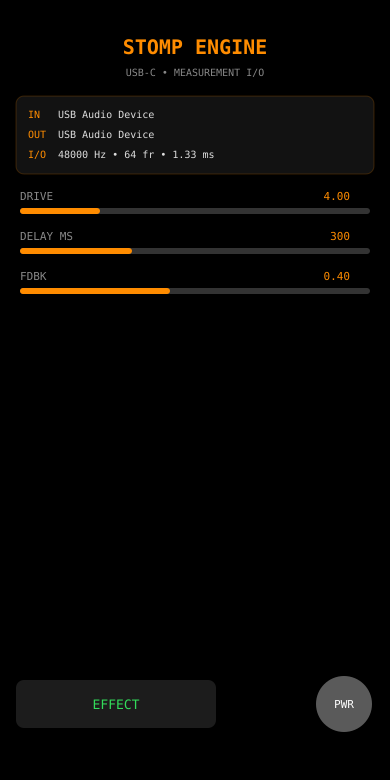

# StompEngine

[](https://github.com/GizzZmo/StompEngine/actions/workflows/ci.yml)
[](https://github.com/GizzZmo/StompEngine/actions/workflows/assets.yml)
[](LICENSE)
[](StompEngine.xcodeproj/project.pbxproj)
[](https://www.swift.org)
[](https://developer.apple.com/xcode/)

Low-latency iOS guitar stomp for a **USB-C class-compliant audio interface**.

Architecture: `inputNode → AVAudioSinkNode` (process) → lock-free SPSC ring → `AVAudioSourceNode → mixer → outputNode`.

The sink is **not** wired to the output (it has no output bus). Processing writes a preallocated ring; the source pulls that ring on the output render.

## Screenshots

<p>
  
</p>

Full-resolution frames live in [`docs/screenshots`](docs/screenshots). CI regenerates them and uploads the PNGs as workflow artifacts (`stompengine-screenshots`, `stompengine-assets`). The simulator `.app` from the macOS job is uploaded as `stompengine-ios-simulator`.

## Open in Xcode

1. Clone this repo.
2. Open `StompEngine.xcodeproj`.
3. Select your development team under **Signing & Capabilities**.
4. Plug in the USB-C interface **before** tapping Power (or tap Power again after a route change — the engine rebuilds).
5. Grant microphone permission when prompted.

Requires iOS 17+, Xcode 15+.

```bash
python3 -m pip install -r Scripts/requirements.txt
python3 Scripts/generate_assets.py
```

## CI

| Workflow | Trigger | What it produces |
|---|---|---|
| [CI](.github/workflows/ci.yml) | push / PR | Asset bundle, screenshots, project validation, unsigned iOS Simulator build |
| [Assets](.github/workflows/assets.yml) | script/docs changes + manual | Regenerates `Assets.xcassets` + `docs/screenshots`, commits on `main`, uploads artifacts |

Download artifacts from the Actions run: **Actions → run → Artifacts**.

## Session

- Category `playAndRecord`, mode `measurement` (no AEC / AGC / system HPF).
- Preferred I/O buffer: 64 frames @ 48 kHz (`≈ 1.33 ms`). iOS may negotiate 64–256; the UI shows the real value.
- No `.defaultToSpeaker` — that steals the route from the interface.

## Real-time rules

Render callbacks do not allocate, lock, log, or hop to GCD. Delay line and ring storage are allocated in `init`. Parameters are single-word stores read at the top of the DSP loop.

## Latency

Round-trip is ADC + safety offset + buffer + DAC, not just `64 / Fs`. A decent USB interface at 48 kHz / 64–128 frames is typically in the ~5–12 ms region. Measure with a loopback cable.
